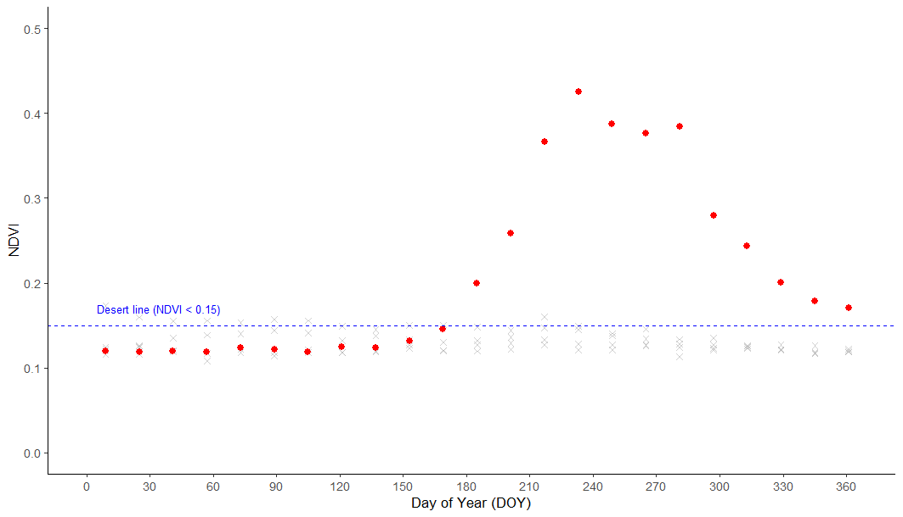
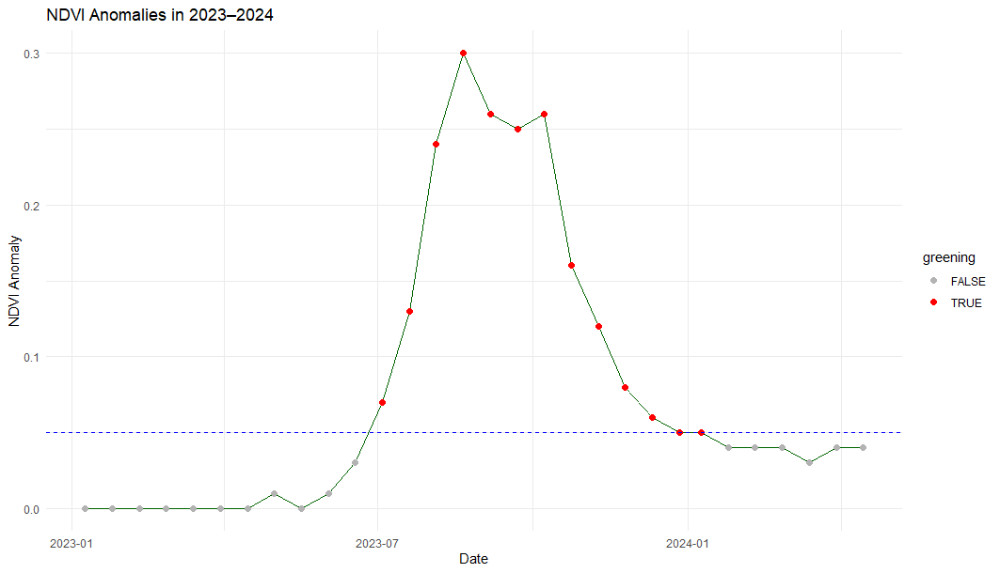
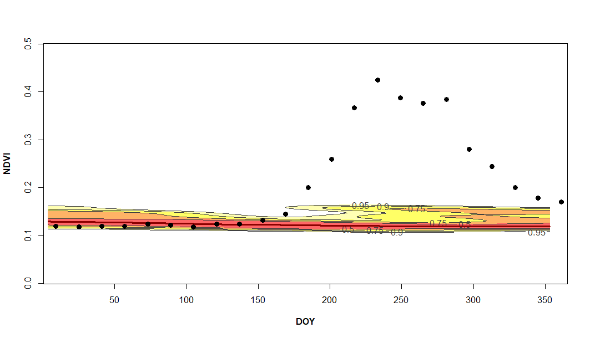

# Desert Bloom & Aridity Dynamics: NDVI–Precipitation Analysis

This repository contains code and notebooks for detecting and analyzing **blooming desert events** and vegetation dynamics in arid regions using **MODIS NDVI/EVI**, **CHIRPS precipitation**. The workflow combines Python notebooks for data access, processing, and correlation analysis with an R script for **phenology-based anomaly detection** (via `npphen`).

> **TL;DR**  
> - Load and clean precipitation and vegetation time series  
> - Quantify NDVI–precipitation relationships and lags  
> - Detect extreme greening anomalies (bloom events) with `npphen`  
> - Visualize and export results for GIS and further analysis  

## 📦 Datasets

This project typically uses the following data sources (adjust paths in notebooks/R script as needed):

- **MODIS NDVI/EVI** (e.g., MOD13Q1 or MYD13Q1, 16‑day) for vegetation dynamics.  
- **CHIRPS** daily precipitation (can be aggregated to 16‑day/monthly) for rainfall forcing.  

## 🗺️ Typical Outputs

- Time series plots (NDVI/EVI and precipitation)
- Lagged correlation curves and tables
- Phenology reference plots (RFD)
- Anomaly time series and **bloom event flags**
- CSV exports for downstream stats; optional GeoTIFF/NetCDF for maps

## 📊 Example Visualizations

Below are some example outputs generated during the analysis:

### 1. NDVI Time Series (2020–2025)
  
This figure shows the NDVI dynamics at a desert pixel from 2020–2025. The dashed line marks the "desert line" (NDVI < 0.15). A strong greening anomaly is visible during mid-2023, highlighted by the shaded area.

---

### 2. NDVI Seasonal Cycle (2023)
  
This plot represents NDVI values by Day of Year (DOY) for 2023. Red points indicate significant greening above the desert line threshold, while grey points represent normal background values.

---

### 3. NDVI Anomalies in 2023–2024
  
This anomaly plot highlights deviations from the expected baseline during 2023–2024. Red dots mark flagged greening events, confirming the unusual vegetation response observed in the desert region.

---

### 4. Reference Phenology Distribution (RFD)
  
The RFD visualization compares the observed NDVI values (black points) against the reference phenological envelope. The warm-colored contours represent the expected NDVI distribution. Points above the envelope mark significant greening anomalies (desert bloom conditions).
## References
- [1] npphen: An R-Package for Detecting and Mapping Extreme Vegetation Anomalies Based on Remotely Sensed Phenological Variability. [https://www.mdpi.com/2072-4292/15/1/73](https://www.mdpi.com/2072-4292/15/1/73)
